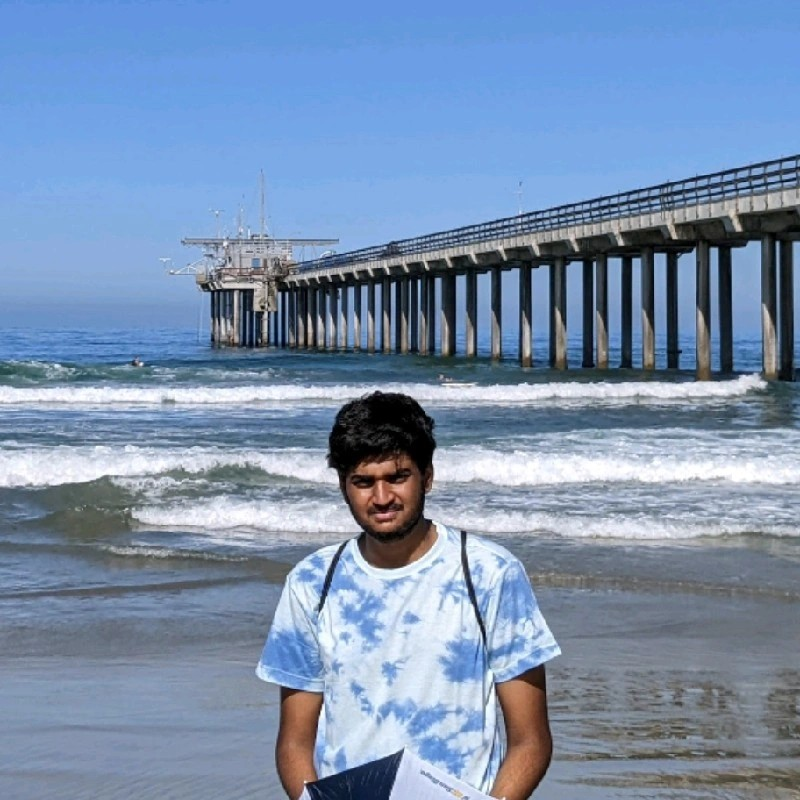

# Aniruddha Dasu - Programmer & Developer



```
print("Hello! I'm Aniruddha Dasu")
```
A passionate programmer and software engineer. I am currently pursuing a **Bachelor of Science in Mathematics-Computer Science** at **UC San Diego**. My journey in programming began with an interest in **problem-solving**, which led me to learn various programming languages and technologies.

## About Me

I am an **enthusiast of technology** and constantly learning to improve my skills. I have experience in **backend development**, **machine learning**, and **full-stack web development**. I enjoy working with frameworks like **React**, **Flask**, and **Tailwind CSS**, and have explored a range of tools from **AWS** to **PyTorch**.

Besides programming, I am deeply interested in *economics* and *politics*. I am also passionate about sports, especially **tennis** (shoutout to my favorite player, **Roger Federer**—the GOAT!).


## My Programming Journey

I started learning programming during my high school years, with a focus on **C++** and **Python**. Over time, I delved into **JavaScript**, **Java**, and **SQL**, building projects that ranged from **API development** to **data preprocessing for research**.

Here’s a quick timeline of my journey:

1. **High School**: First learned JS and Python.
2. **College**: Entered as Econ major and switched after my first quarter. Started working on full-stack applications, including a **Merchant Portal** project using **React** and **Flask**.
3. **Internship**: Gained hands-on experience as a Software Engineering Intern at **Node** and **Avenue Ecommerce Ltd.**.

## Projects

- [**ba.chat**](https://github.com/adasu14/ba.chat): A messaging platform project built using **React** and **Node.js**.
- [**TritonScript**](https://github.com/AniruddhaDasu/TritonScript): A **compiler** I built as part of my coursework.
- [**Insignia**](https://github.com/AniruddhaDasu/Insignia): A **React**-based project for managing tasks and activities.

## Skills

- **Programming Languages**: Python, Java, C++, JavaScript, SQL
- **Frameworks/Technologies**: React.js, Flask, AWS, PyTorch, Tailwind CSS
- **Tools**: Git, Docker, Postman, VS Code

## Contact Me

Feel free to connect with me through these platforms:

- [LinkedIn](https://www.linkedin.com/in/aniruddhadasu)
- [GitHub](https://github.com/adasu14)

---

### A Little Quote About My Journey

> "The more I learn, the more I realize how much I still have to explore. But that's what makes programming exciting."

## Facts about me

- I speak three languages (English, Telugu, and Hindi)
- I've been to 8 countries

## Task List

- [x] Complete all assignments for the **Advanced Data Structures** course.
- [ ] Contribute to open-source projects on GitHub.
- [ ] Learn more about **cloud computing** and **DevOps**.

## Link to Another Section

You can jump to my **[Projects](#projects)** section for more details about my work.
